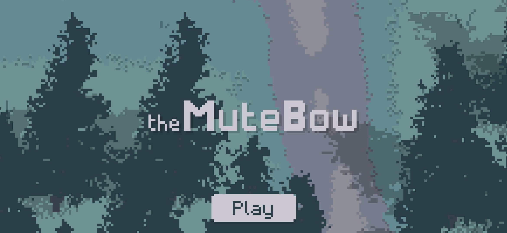

# The Mute Bow

## Links

-   Use [this link](https://the-mute-bow.github.io/) to play.

-   View on my [portfolio](https://iconejey.github.io/#the-mute-bow-page).

## Change log

### **B2.0.22**

-   New app icon.
-   Night soundtrack replaced by `'night-ambient.mp3'`.
-   Night soundtrack is set to `'dark-ambient.mp3'` when fog is on.
-   Removed `'nature-ambient.mp3'`.
-   Nicer and more efficient fog for low performance devices.
-   Player can only see `Creature`'s aura when there is no fog.

### **B2.0.21**

-   `game.fog_map` won't remember light pixels (less RAM consumption) and will use screen borders.
-   Multiple `Human` can see in `game.fog_map`.
-   Test for a new app icon.
-   `'rain-piano.mp3'` is now the night soundtrack.

### **B2.0.20**

-   Larger `Human` aura.
-   Stronger `Human` shoot.
-   `game.fog_map`.
-   `game.fog_map.pix_size` now adaptative to device performances.

### **B2.0.19**

-   `Human` aura.
-   `Creature` dark aura.
-   `Creature` exclam alert and hunting `Human` if too close.
-   `Creature` stops hunting if human too far

### **B2.0.18**

-   Text overlays.
-   Pause text.
-   Fps counter.
-   `Creature` entities.
-   `Arrow` trails.
-   `Human.stamina.val` goes up faster.

### **B2.0.17**

-   `'pause'` mode now sets `game.speed` to 0.1.
-   Fixed `'menu2-button'` && `'pause-button'` cache error.
-   Fixed `Arrow` not getting stuck in solids.
-   Fixed `Human.sprites['bow-aim']` always drawed in front of `Human.sprites.main`.

### **B2.0.16**

-   `'pause'` mode.
-   Quit / resume / pause buttons.

### **B2.0.15**

-   `game.player` aims with right joystick.
-   `Human` look where they aims if `Human.stamina.val > 0`.
-   Bow aim draw for `Human` instances.
-   `Particle` and `Trail` classes.
-   Line drawing.
-   `Arrow` shooting and drawing.
-   `Arrow` get stuck in the ground by gravity.
-   Shooting `Arrow` drains `Human.stamina` and costs 1 wood.
-   _No amo_ and _plus_ icons.

### **B2.0.14**

-   Screenshot of `game.can` via command line with `game.screenshot()`.
-   Bigger map for `menu` and `chap1`.
-   Added language button to `'menu'` page.
-   `game.player.weapon` hold draw.
-   `'-night'` variant for `Human`.
-   New app icon.
-   Updated cache file list.

### **B2.0.13**

-   Beta weapon selection with buttons via right `'tap'` event.
-   `Human.alert` and weapon indication.

### **B2.0.12**

-   Fixed button opacity problem.
-   Overlays.
-   Title on menu screen
-   Added sounds to cache.

### **B2.0.11**

-   Borders on touch surface to prevent unwanted touches.
-   fade apearing for buttons.
-   Click sound for buttons.
-   Game soundtrack.

### **B2.0.10**

-   Left special move chaged from dodge/boost to sprint.
-   True menu and chap1 pages.
-   Buttons and game events.

### **B2.0.9**

-   Human footsteps.
-   `'strat'` game mode with left tap.
-   `game.speed = 0.1` in strategy mode.
-   Everything darkens in strategy mode except Humans.
-   Strategy mode allows to make `Human` instances to follow `game.player`'s movements of to go/stay at a `(x, y)` position.

### **B2.0.8**

-   Hard colisions with `Entity` and `Tree` instances.
-   Soft colisions with other `Human` instances.
-   Dicreased `cam.h`.

### **B2.0.7**

-   `Human` walk cycle.
-   Scott got a new haircut.
-   Left `'special'` touch gives a speed boost to player and drains stamina.

### **B2.0.6**

-   Fixed game crash caused by `'special'` touch event detection.
-   Fixed service worker version.
-   Added `menu.js` images to cache storage.

### **B2.0.5**

-   Trees with animation.
-   Tree calc.
-   Entities are now drawed acording to `Entity.getFeet().y`.
-   Entities now have shadows.
-   Test for `viewport-fit=cover` in `viewport` meta tag.

### **B2.0.4**

-   Better camera system and transitions with `game.cam.target` and `game.cam.targ_h`.
-   Using `game.cam.h` to calculate `game.scale`.
-   Black screen with animation through `game.cam`.
-   Humans with four characters: Eliot, Karmen, Lea and Scott.
-   Use of a `Human` instance for `game.cam.target`.
-   `game.player` is now a `Human` instance and moves thanks to the left joystick.

### **B2.0.3**

-   Resolved _turn the screen_ page not displaying after loading the page.
-   Added French version for update pop up.
-   View centered on `game.cam` coordinates.
-   Cookies now last 2 years.
-   Added `'tap'` and `'drag'` touch events.
-   Added joysticks' logic and graphics.
-   Added Licence.
